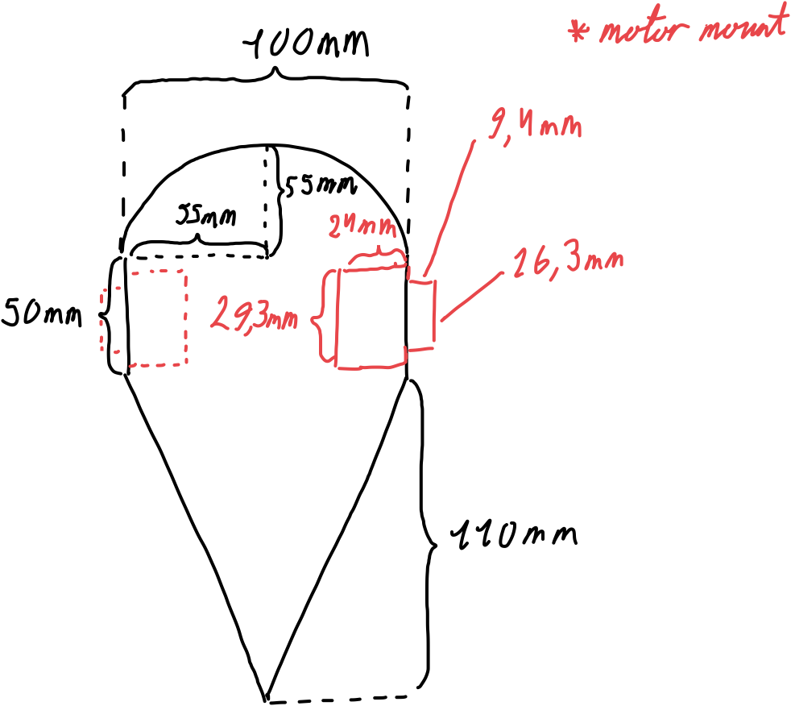
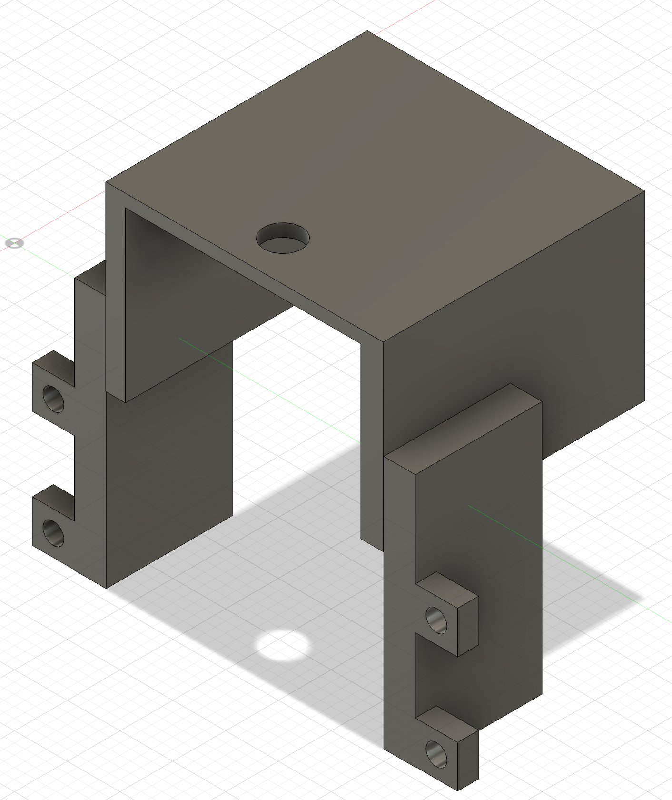
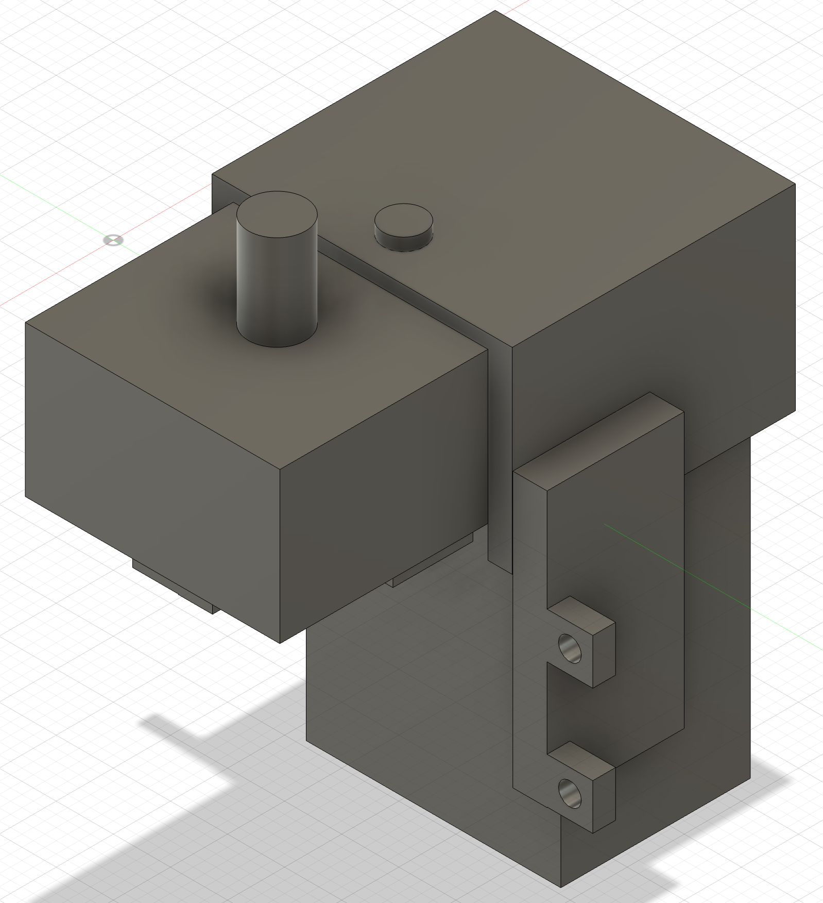
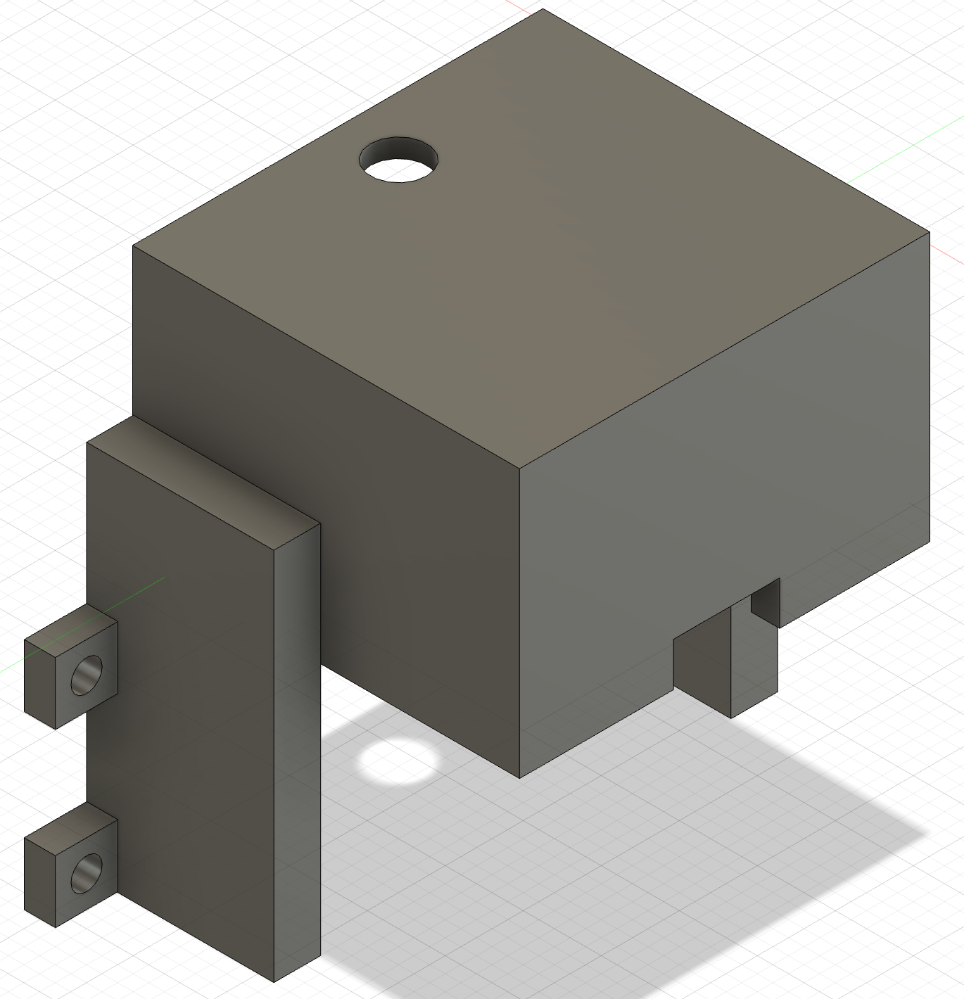
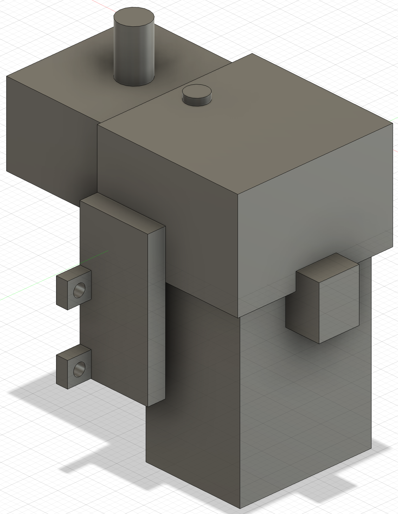
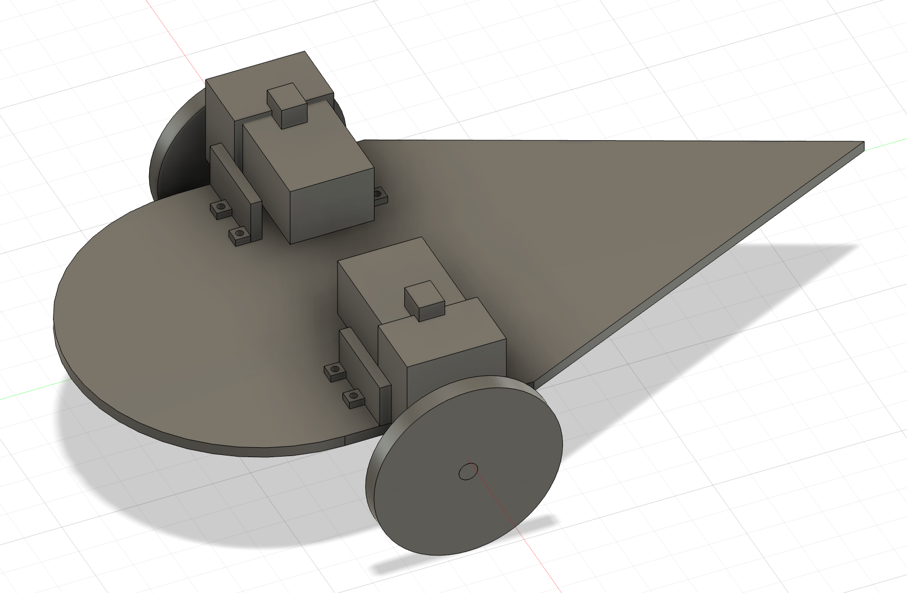

# MA 2

Created by Lukas Engilbjartur Eliassen ([luel](mailto:luel@itu.dk)) and Lucas Hanson ([luha](mailto:luha@itu.dk))

## 1. Preliminary design of robot

Our preliminary design of the robot is based on the following:

- Overall simple design
- Only needs two motors
- Only needs two wheels
- Lot of space for other electronics

Below the design is shown:

## 2. Model for motor holder

Our model for the motor holder was created by creating an overall cube which was bigger than the motor.
Then we subtracted the motor itself from the cube to create a hole for the motor to fit in.
Afterwards we created the parts which will allow us to attach the motor holder to the robot/plywood.

We are aware that this model will probably not work as the print may have a slightly smaller inside than the motor itself.
But as our design is also based on a tight fit we have to modify the model after the first print.
This can fortunately be done quite easily in Fusion 360 as we just have to increase the size of the original motor design.

Here is the design of the motor holder:

| Only holder | Holder with motor |
| --- | --- |
|  |  |
|  |  |

You can access it [here](https://a360.co/3WN6Qfl).

## 3. Create an assembly

First we created the wheel, which was done by creating two circles and extruding them to create a cylinder.

Here then fit every part together to create the assembly, as seen below:

You can access it here [here](https://a360.co/4jRMQlH).
