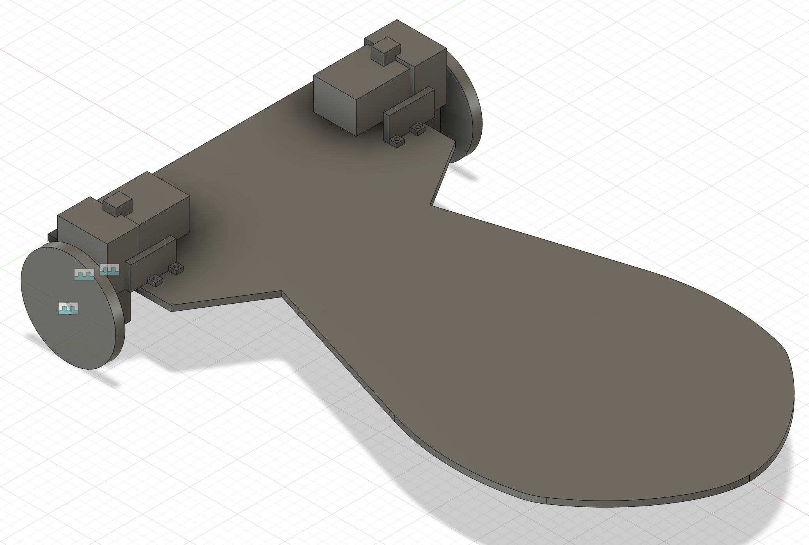
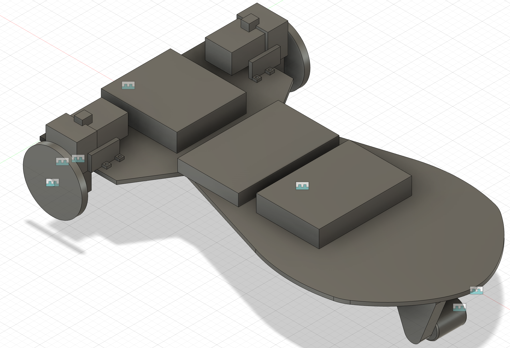
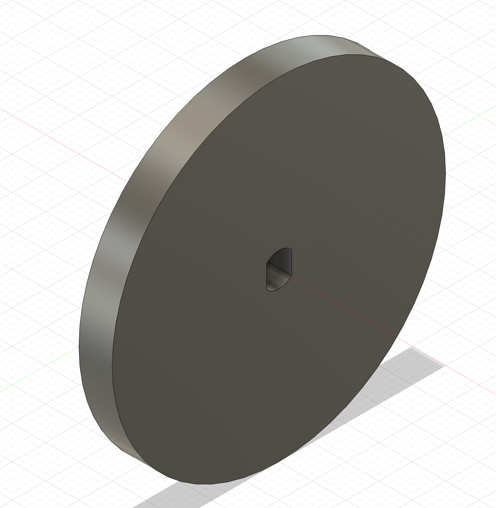
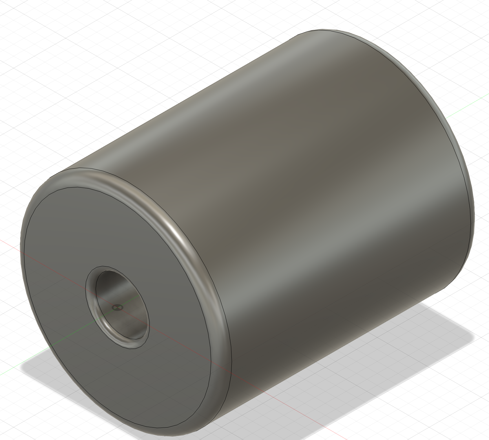
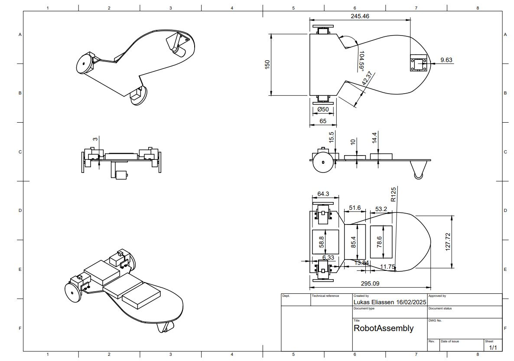

# MA 2

Created by Lukas Engilbjartur Eliassen ([luel](mailto:luel@itu.dk)) and Lucas Hanson ([luha](mailto:luha@itu.dk))

Group: Luckas

## 1. Base Design

Below you can see the base design.
Our first goal was to have space enough for the motors, motor holders, the battery pack, the Arduino, the breadboard, and a front wheel.
The second goal was to have a design which looked slightly like a nuke.

You can see them in more details by following the links below:

- [Base design with motors](https://a360.co/4hDEWef)
- [Base design with all components](https://a360.co/41iMyNC)

## 2. Laser Cutting

We unfortunately did not have time to laser cut the base.
But you can see the design above.

## 3. Wheel Design

The rear wheels are the same as in MA2:

We wanted to have fun with the front wheel, se we designed it as a drum wheel:

You can see them in more details by following the links below:

- [Rear wheel](https://a360.co/3CVIOIy)
- [Front wheel](https://a360.co/41hDetd)

## 4. Robot Assembly

Was shown in [1. Base Design](#1-base-design).

## 5. Technical Drawing

Here is the technical drawing with the basic dimensions of the robot assembly

