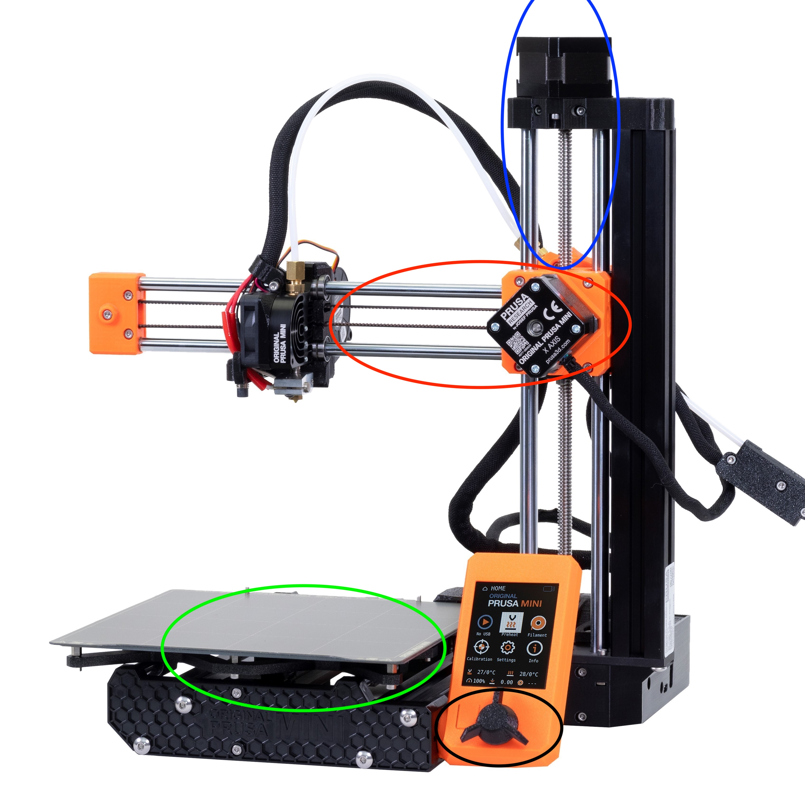

# MA 4

Created by Lukas Engilbjartur Eliassen ([luel](mailto:luel@itu.dk)) and Lucas Hanson ([luha](mailto:luha@itu.dk))

Group: Luckas

## Chosen Mechanism

We chose a 3D printer as it has various mechanisms.
Example printer can be seen below:

### Belt drive

In the red circle we can see a belt drive, where the pulley with motor is on the right side.
The nozzle of the printer is connected to the belt itself.

The bed of the printer is also connected to a belt drive, but is harder to see.

The reason belt drives are chosen are probably because of cost but also as a print will not be affected by a power loss.

### Lead screw

In the blue circle we can see the lead screw, where the motor is connected on the top and the y-axis of the extruder is connected to the lead nut.

The lead screw is chosen as it can be very precise and also in case of a power loss the print will not be affected, as the mechanism is self-locking.

### Other

In the green circle the clicker and spinner to control the printer can be seen.
I guess it could be argued that this is sort of a mechanism as well as we have to translate the movement of the spinner into some digital signal, as well as the clicker.
But for the slides we were shown it is not a mechanism.

## Designed Mechanism

We have designed a belt drive mechanism with two sprockets that turns two wheels. Creating a live belt in fusion is not possible and or very time consuming according to multiple sources online, so this is a simulation of the belt drive where both the sprockets turn by animation which turns the wheels.

Here is a link to see the mechanism. Try pulling on some of the components and see the others move as well.
https://a360.co/41gLGrF

