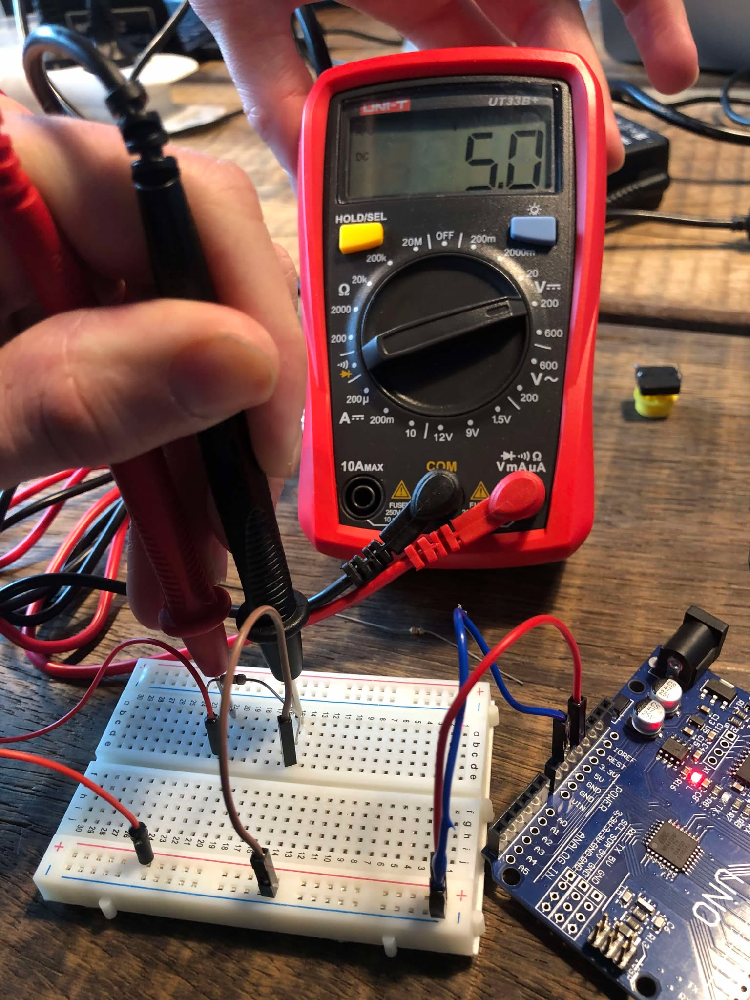
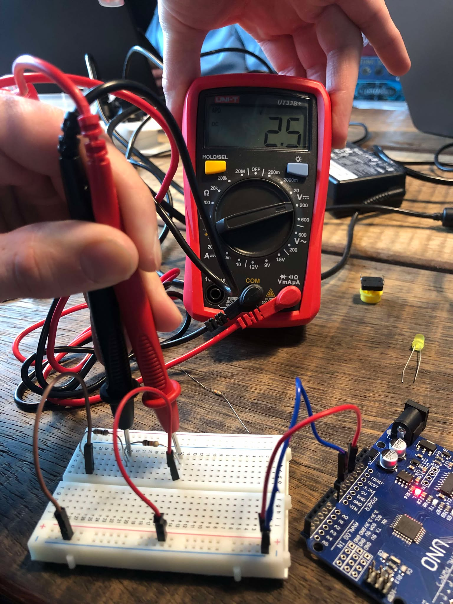
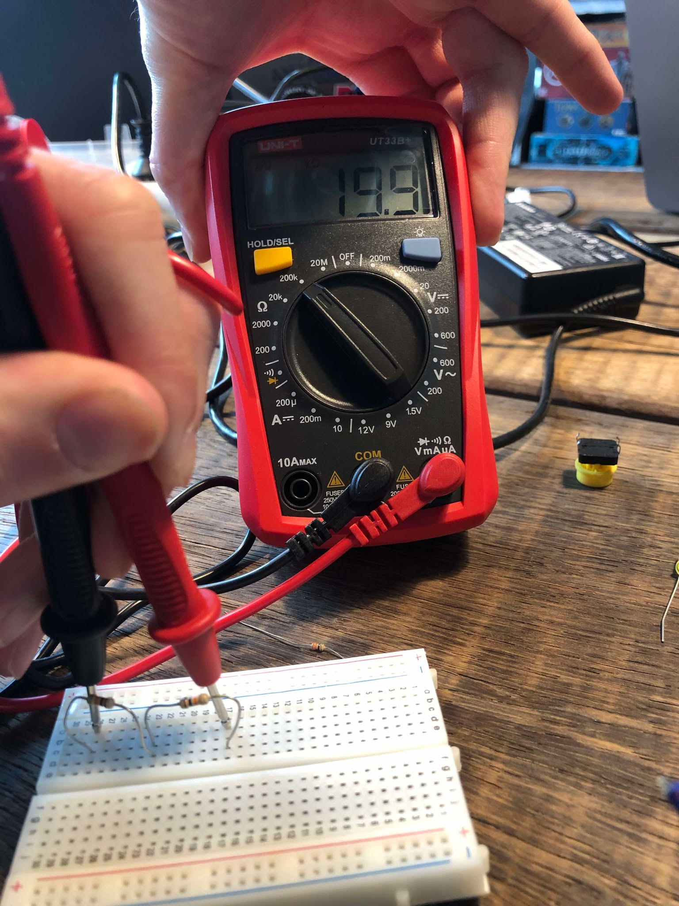
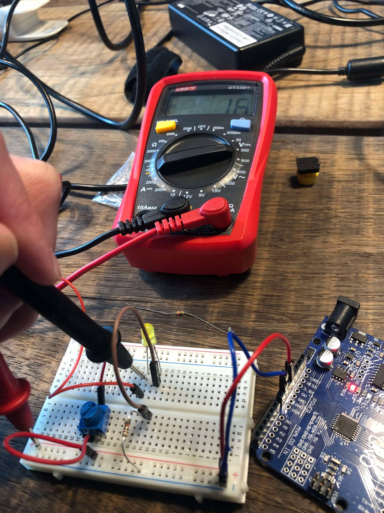
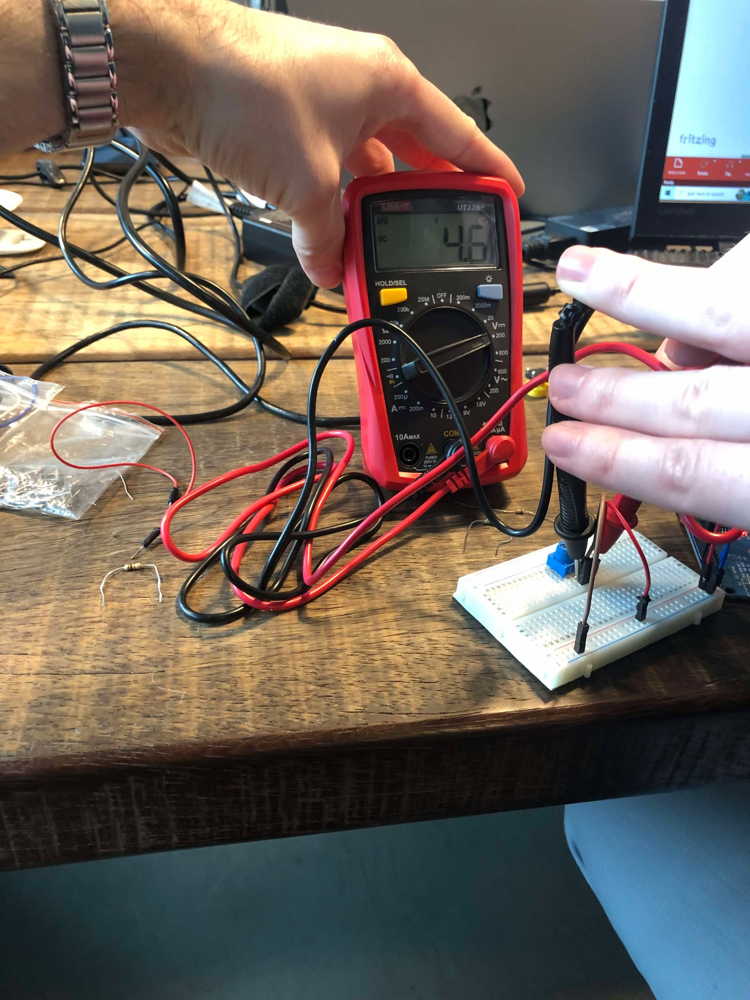
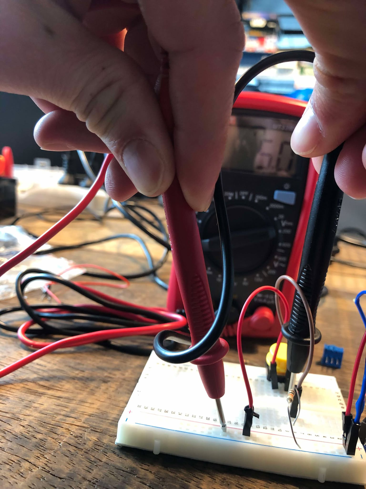
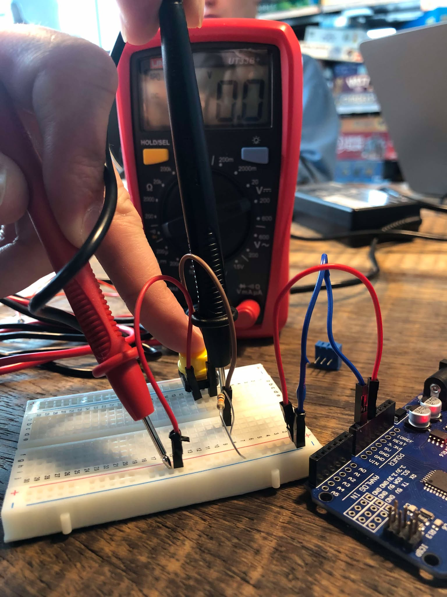

# MA 5

Created by Lukas Engilbjartur Eliassen ([luel](mailto:luel@itu.dk)) and Lucas Hanson ([luha](mailto:luha@itu.dk))

Group: Luckas

## Exercise 1

## Exercise 2

### Resistors

### Parallel

### Serial

### Voltage divider

## 4 circuits

### Control led with potentiometer circuit

### Read potmeter with no resistance

### Read potmeter with resistance

### Read switch (not pressed)

### Read switch (pressed)

## Note

You can find all the circuits in [here](https://github.com/lucasfth/HTMAA/blob/main/MA5/fritzing/MA5.fzz).
You can find all the schematics [here](https://github.com/lucasfth/HTMAA/blob/main/MA5/fritzing)
