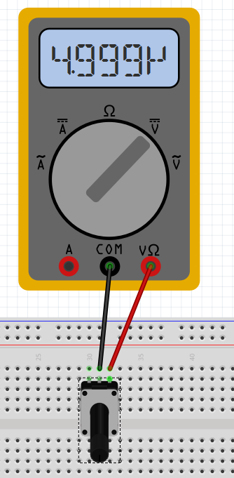

# MA 5

Created by Lukas Engilbjartur Eliassen ([luel](mailto:luel@itu.dk)) and Lucas Hanson ([luha](mailto:luha@itu.dk))

## Exercise 1

## Exercise 2

## 4 circuits

### Control led with potentiometer circuit.

### Read potmeter with no resistance (aka kaboom)

### Read potmeter with resistance

### Read switch (not pressed)

### Read switch (pressed)

